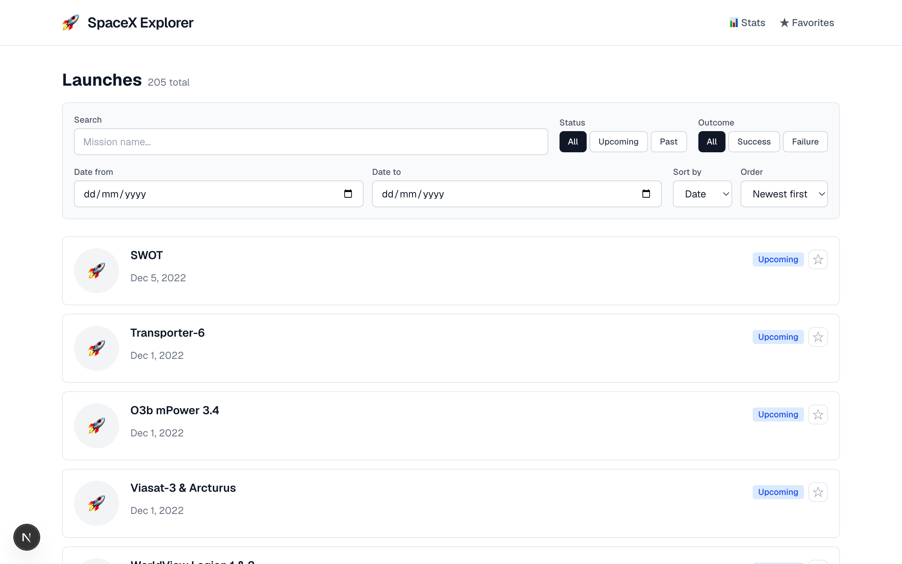
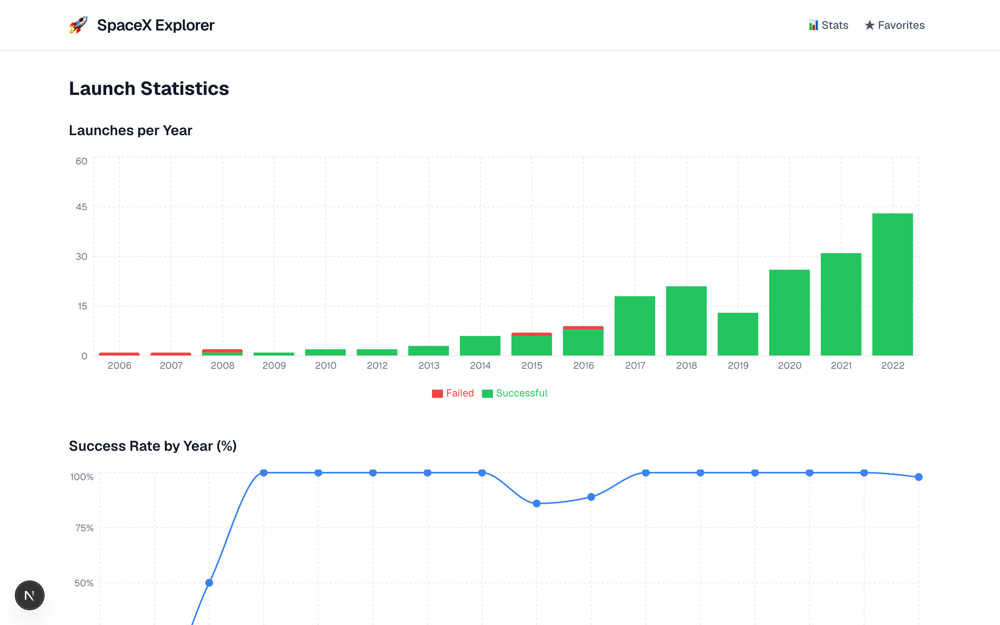

# SpaceX Explorer

A production-ready SpaceX launch browser built with Next.js 16 and the public [SpaceX API v4](https://api.spacexdata.com/v4).

**Live:** https://digt-ag-space-x-explorer.vercel.app

| Launches list | Launch statistics |
|:---:|:---:|
|  |  |

---

## How to Run

```bash
npm install
npm run dev        # http://localhost:3000
npm run build      # production build
npm test           # Vitest unit tests
npm run test:watch # watch mode
```

---

## Architecture Decisions

### App Router vs Pages Router

Next.js 16 App Router was chosen over Pages Router for several reasons:

- **Layouts without re-renders**: `app/layout.tsx` wraps `QueryClientProvider` once; navigation between routes doesn't remount the provider or lose cached data.
- **Colocation**: route segments live next to their components (`app/launches/[id]/page.tsx`), making the file tree a direct map of the URL structure.
- **Future-proof**: Pages Router is in maintenance mode; App Router is the active development target.

The project is deployed on Vercel, which provides full SSR support. Server Components are used for layout and static structure; all data fetching is client-side via React Query, keeping the bundle predictable and the API surface simple.

---

## Data Layer

### Why React Query (`@tanstack/react-query`)

The SpaceX API is a read-heavy external API with no authentication. React Query is the right tool because:

- **Automatic deduplication**: multiple components requesting the same data share a single in-flight fetch.
- **Background refresh**: stale data is served instantly while a background refetch runs, keeping the UI responsive.
- **Retry with backoff**: 429/5xx errors trigger automatic exponential backoff (2s → 4s → 8s cap); 4xx errors (other than 429) are not retried — this distinction is important to avoid hammering an API that's returning "bad request."
- **`useInfiniteQuery`**: built-in cursor/page management for the "load more" / infinite scroll pattern, with automatic `getNextPageParam` resolution.
- **DevTools**: the `@tanstack/react-query-devtools` panel makes cache inspection trivial during development.

### SpaceX API Usage

All list queries go to `POST /launches/query` with a MongoDB-style body:

```json
{
  "query": { "upcoming": false, "success": true },
  "options": { "offset": 0, "limit": 20, "sort": { "date_utc": -1 } }
}
```

Filtering, sorting, and search all happen **server-side** — the client never fetches a full dataset and filters locally. The `$regex` / `$options` fields handle mission-name search with a 300 ms debounce.

Detail pages fetch three endpoints in parallel:
- `GET /launches/:id`
- `GET /rockets/:id`
- `GET /launchpads/:id`

Filter state is serialized to URL search params so links are shareable and the browser back button works correctly.

---

## Performance Considerations

### Virtualization

`react-window` (`FixedSizeList`) renders only the visible launch cards plus a small overscan buffer. Without virtualization, a 200-launch dataset would mount 200 DOM nodes; with it, roughly 10–15 are in the DOM at any time regardless of how many pages have been loaded.

Infinite scroll is driven by `onItemsRendered` — when the last rendered index approaches the total count, `fetchNextPage()` is called. This avoids a separate `IntersectionObserver` managing a sentinel element.

### Memoization

- Launch cards are wrapped in `React.memo` — they only re-render when their `launch` prop reference changes, not when siblings update.
- The `itemData` object passed to `FixedSizeList` is stable across renders (memoized with `useMemo`), preventing all card re-renders when the list re-renders.
- Filter/query objects passed to React Query are built from URL search params; identical param strings produce cache hits without new fetches.

### Background Refresh

`staleTime: 5 * 60 * 1000` — data is considered fresh for 5 minutes. Returning to the tab after more than 5 minutes triggers a background refetch while stale data remains visible, so the user never sees a loading spinner on revisit.

---

## Accessibility Considerations

- All interactive elements have accessible names: `aria-label` on icon buttons, `<label>` on form controls, descriptive link text.
- Dynamic regions (loading, error states) use `aria-live="polite"` so screen readers announce updates without interrupting.
- `focus-visible` outline is preserved everywhere — keyboard users get a clear focus ring; mouse users don't see it cluttering the UI.
- Page structure uses semantic landmarks: `<header>`, `<main>`, `<nav>`, `<section>` with `aria-labelledby`.
- Color is never the sole carrier of meaning: success/failure status uses both color and a text label / icon.
- The stats charts include accessible titles and axis labels; data is also available in the underlying list view.
- Tested with axe-core and manual keyboard navigation across all routes.

---

## Tradeoffs and What's Next

### Conscious Tradeoffs

| Decision | Reason |
|---|---|
| Client-side data fetching | All API calls happen in the browser via React Query. SSR/ISR is available on Vercel and would improve first-paint — left as a next step. |
| No Service Worker / offline support | Adds significant complexity for a read-only demo. React Query's cache covers most "briefly offline" cases already. |
| `react-window` fixed row height | Variable-height virtualization (`react-virtualized`) is considerably more complex. Fixed height works well for uniform launch cards. |
| No comparison view | Comparing two launches side-by-side is a natural next feature but was out of scope. |

### Known Limitations

- **No pagination state in URL for infinite scroll**: the current page count is held in React Query's in-memory `pageParam`. A hard refresh resets to page 1. Persisting scroll position across sessions would require encoding `pages` in the URL or using `sessionStorage`.
- **API rate limits**: the SpaceX API is public and unauthenticated. Heavy use may hit undocumented rate limits; the retry/backoff configuration handles transient 429s but sustained overuse has no mitigation.

### What's Next

- **SSR/ISR on Vercel**: enable ISR for the launches list — first paint would be server-rendered HTML instead of a skeleton. The infra is already in place on Vercel; it's a matter of moving fetches to Server Components.
- **Comparison view**: select two launches and diff their specs.
- **Service Worker**: offline-first with Workbox, pre-cache the first page of launches.
- **E2E tests**: Playwright tests covering the full filter → infinite scroll → detail flow.
